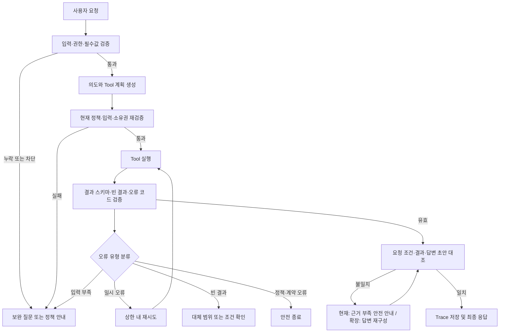

# 산출물 2｜에이전트 시험 결과 보고서

> 서비스명: **베베온 (AI Baby Care Assistant)**
> 대상: 0~36개월 영유아 보호자를 위한 AI 육아 도우미  
> 시험 대상: `baby_care_agent`, `baby_care_server`, `baby_info_server` 및 FastAPI 연동 경로  


## 1. 시험 목적

본 시험은 동일한 요청 데이터에서 **기준선 처리(Baseline)** 와 **자기 성찰(Reflection) 검증 루프 적용 처리**를 비교한다. 비교 지표는 태스크 완료율, 응답 일관성, 평균 재시행 횟수이며, Tool 선택은 계획을 직접 주입한 통제 평가의 **계획 유지율**과 독립 자연어 입력 평가의 **Tool 선택 정확도**로 분리해 측정한다.

자기 성찰 루프는 모델의 숨겨진 추론을 저장하거나 노출하는 기능이 아니다. Tool 실행 전후의 구조화된 입력·출력, 정책, 사용자 요청 조건을 다시 대조하여 오류를 감지하고 안전한 다음 행동을 선택하는 실행 검증 절차이다.

### 1.1 시험 범위

- 육아 기록 저장·조회와 생활 패턴 조회
- 월령별 육아 RAG 검색
- 소아과·응급실 검색
- 일반 육아 안내의 안전 제약
- STT 승인 기록의 중복 실행 방지
- Tool 결과 스키마·카테고리·최종 응답의 정합성

### 1.2 비교 조건

| 구분 | Baseline | Reflection 적용 |
| --- | --- | --- |
| 입력 검증 | 요청별 결정론적 검증 | 동일 검증 + 누락 원인 구조화 기록 |
| Tool 실행 전 | 라우팅·Allowlist·필수값 확인 | Tool 계획과 정책·필수 인수의 재대조 |
| Tool 실행 후 | MCP 응답 성공 여부 및 일부 스키마 검증 | 스키마·빈 결과·오류 코드·요청 조건·답변 초안 대조 |
| 실패 처리 | 구현된 폴백 또는 예외 종료 | 오류 분류 후 재시도·보완 질문·대체 전략·안전 종료 선택 |
| 최종 응답 | 각 라우팅 함수가 구성 | 검증 통과한 결과만 근거로 재구성 |

## 2. 시험 환경 및 데이터 구성

### 2.1 환경

| 항목 | 내용 |
| --- | --- |
| Agent Runtime | Python 기반 FastAPI Agent Service |
| 모델 사용 지점 | 의도 분류, 일반 육아 안내 생성 |
| 데이터 저장 | PostgreSQL, Redis |
| Tool 연동 | `baby_care_server`, `baby_info_server` MCP |
| 외부 연동 | 병·의원·응급의료기관 공공데이터 API |
| 시험 방식 | 단위 시험 + MCP 응답 모의(Mock) + 통합 시험 Trace 비교 |

### 2.2 시험 데이터셋

산출물 1의 정상(`N`)·예외(`E`) 시나리오를 재사용하고, 자기 성찰 검증을 위해 결과 불일치·반복 호출 케이스를 추가한다. 아래 건수는 권장 최소 구성이다. 실제 비교 시 각 케이스의 동일한 입력, 사용자·아기 컨텍스트, Mock 결과를 두 조건에 공통 적용한다.

| 유형 | 권장 건수 | 대표 확인 항목 |
| --- | ---: | --- |
| 정상 조회·추천·생성 | 20 | 기대 Tool 선택, 완료 상태, 응답 근거 |
| 필수 파라미터 누락 | 10 | Tool 호출 전 보완 질문 여부 |
| 도구 선택 오류 유발 | 10 | 기대 Tool 외 호출 차단 여부 |
| Tool 결과 스키마·카테고리 오류 | 10 | 결과 폐기 및 안전 종료 여부 |
| 빈 결과·근거 부족 | 10 | 사실 기반 빈 결과·대체 범위 안내 |
| API/MCP 타임아웃·연결 실패 | 10 | 재시도 상한 및 종료 정책 |
| 권한·STT 승인·중복 요청 | 10 | 정보 차단, 승인·멱등성 검증 |
| 최종 응답 불일치 유발 | 10 | Tool 결과와 답변 재대조 여부 |
| **합계** | **90** | 동일 데이터셋으로 전후 비교 |

### 2.3 Baseline 자동 시험 실행 결과

2026-09-09에 현재 구현을 Baseline으로 하여 `backend/tests`, `mcp_servers/baby_care_server/tests`, `mcp_servers/baby_info_server/tests`를 실행했다.

| 항목 | 실측 결과 | 비고 |
| --- | ---: | --- |
| 전체 수집 테스트 | 161개 | `backend/tests`, 두 MCP 서버 테스트를 명시적으로 함께 실행한 현재 기준 |
| 통과 | 119개 | 실패 0개 |
| 건너뜀 | 42개 | PostgreSQL 연동 39개, Stool RAG DB 연동 3개 |
| 실행된 테스트 통과율 | 100% | 119 ÷ 119 |
| 실행 시간 | 3.50초 | `pytest backend/tests mcp_servers/baby_care_server/tests mcp_servers/baby_info_server/tests -q -rs` 기준 |

건너뜀은 기능 실패가 아니라 `RUN_DB_TESTS=1` 또는 `RUN_RAG_DB_TESTS=1`이 설정된 DB 통합 환경에서만 실행하도록 구성된 테스트다. 따라서 이 결과는 **현재 자동화된 단위·Mock 시험의 Baseline 통과 결과**이며, DB·외부 연동을 포함한 전체 통합 시험 완료를 의미하지 않는다.

### 2.4 Live API 통합 평가 결과

2026-09-09에 실행 중인 Backend·Redis·두 MCP 서버를 대상으로 읽기 전용 자연어 20건을 실제 채팅 API로 실행하고 Redis Trace를 함께 수집했다. 평가기는 테스트 사용자 `user-002`의 새 세션을 사용했으며, 육아 기록을 새로 저장하지 않아 데모 DB 데이터를 변경하지 않았다.

| 항목 | 실측 결과 | 근거 |
| --- | ---: | --- |
| Live 요청 | 20건 | 조회·보완 질문·병원·RAG·일반 안내·범위 밖·알레르기 |
| 기대 Tool·응답 유형·Trace 충족 | 20/20 | HTTP 200, `selected_tools`, `response_type`, Redis Trace 동시 대조 |
| Trace에 실제 Tool명 기록 | 20/20 | Tool 미호출 또는 실제 MCP Tool명 확인 |
| 기본 실행 단계 | 4단계 | `planning → policy → executing → verified` Trace 확인 |
| 원본 증빙 | JSON 1개 | `artifacts/live_agent_evaluation_20260909_201413.json` |

Trace에는 실제 Tool명, 안전한 인수 요약, 결과 검증 상태, 재시도 횟수, `step_count`, `max_steps=6`을 저장한다. 병원 오류 재시도와 단계 초과는 외부 서비스를 중단시키지 않고 통제 자동 시험으로 별도 검증했다.

## 3. 오류 감지 기준

| 오류 유형 | 감지 기준 | 판정 예시 |
| --- | --- | --- |
| 할루시네이션 | Tool 결과·RAG 출처·등록 프로필에 없는 사실을 확정적으로 답변에 포함 | 검색 결과에 없는 병원명·주소를 제시하거나, 저장되지 않은 수유 기록을 안내 |
| 도구 선택 오류 | 요청 의도와 기대 Tool이 다르거나, Tool 없이 처리해야 할 요청에 Tool을 호출 | 지역 없는 병원 검색에 검색 Tool 호출, 조회 요청에 기록 저장 Tool 호출 |
| 파라미터 누락 | Tool 계약의 필수 인수 또는 값 범위가 충족되지 않음 | 수유량 없는 수유 저장, 지역 없는 병원 검색, 잘못된 `event_type` |
| 정책·권한 오류 | Allowlist, 소유권, STT 승인, 금지 행위 정책 위반 | 타 사용자 `baby_id`, 승인 전 STT 저장, 진단·처방 요청 |
| 결과 스키마 오류 | 성공 응답의 필수 필드·타입·요청 카테고리·출처가 계약과 다름 | `feeding` 검색에 `sleep` 카테고리 결과 반환 |
| 빈 결과 처리 오류 | 빈 목록·근거 부족을 실패 또는 허위 성공으로 안내 | 병원이 없는데 목록을 생성하거나 RAG 출처를 꾸며 냄 |
| 응답 불일치 | 최종 답변의 기록값·시각·병원 정보·출처가 Tool 결과와 다름 | 저장 결과는 100ml인데 답변이 120ml라고 안내 |
| 반복 초과 | 같은 목적의 호출을 이유 없이 상한 이상 반복 | 일시 오류 외 동일 Tool을 3회 이상 호출, 멱등 키 없이 저장 재호출 |

## 4. 자기 성찰 루프

> 적용 범위: 현재 MVP의 정책 기반 `AgentLoop`은 계획 → Allowlist Tool 실행 → 결과 기본 검증을 수행하고 상세 Trace를 남긴다. 현재 구현된 Reflection은 필수값 누락의 보완 질문, 병원 검색 Tool의 1회 재시도·안전 종료, RAG 근거 부족의 안전 폴백이다. 자동 원인 분석, 응답 불일치 재구성, 모든 오류 유형의 재계획·재실행은 확장 Reflection 설계이며 후속 통합 시험 범위다.



### 4.1 단계별 검증 항목

1. **입력 검증**: 세션, `user_id`, `baby_id`, 입력 출처, 필수 필드, 값 범위를 확인한다.
2. **Tool 계획 검증**: 현재는 MCP Allowlist, 요청 의도, 소유권·입력·STT 승인 정책을 확인한다.
3. **결과 검증**: 현재는 성공 여부, RAG 근거 부족·빈 결과, 병원 검색 오류를 확인한다.
4. **오류 분류**: 현재는 입력 부족, 병원 검색의 일시 오류, 근거 부족을 우선 분류한다.
5. **전략 선택**: 보완 질문, 병원 검색 1회 재시도, 근거 부족 안전 안내, 안전 종료 중 하나를 선택한다.
6. **확장 검증**: 결과 스키마 전수 검증, 응답 값 자동 재구성·재대조는 확대 Reflection 시험 항목으로 유지한다.

## 5. 오류 유형별 재시도 및 대체 전략

| 오류 유형 | 최대 재시도 | 수정·대체 전략 | 종료 조건 |
| --- | ---: | --- | --- |
| 필수 파라미터 누락 | 0회 | Tool 호출을 중지하고 누락 값만 질문 | 필수값 확보 또는 사용자 취소 |
| 입력 범위·형식 오류 | 0회 | 유효 범위와 입력 예시 제시 | 수정된 입력 수신 또는 종료 |
| 병원 API 타임아웃 | 추가 1회 | 동일 요청을 제한적으로 재시도 후 지연 안내 | 성공 또는 1회 재시도 실패 |
| 병원 검색 MCP 연결·일시 오류 | 추가 1회 | 동일 요청을 1회 재시도 | 성공 또는 실패 사실·대체 경로 안내 |
| 그 외 MCP 연결 실패 | 0회 | 실패 사실과 대체 경로 안내 | 안전 종료 |
| 호출 한도 초과 | 0회 | 재실행 가능 시점·대기 안내 | 사용자가 이후 다시 요청 |
| RAG/병원 빈 결과 | 0회 | 빈 결과를 사실대로 안내하고 지역·월령·질문 범위 보완 제안 | 조건 보완 또는 종료 |
| 결과 스키마·카테고리 불일치 | 0회 | 결과 폐기, 계약 오류 Trace 기록, 사용자에게 근거 부족 안내 | 유효 결과 재확보 또는 안전 종료 |
| 일정/기록 중복 실행 | 0회 | `idempotency_key`로 기존 실행 결과 반환 | 기존 결과 반환 |
| 최종 응답 불일치 | 0회 (현재) | 근거 부족 안전 안내 및 Trace 기록; 자동 재구성은 확대 시험 | 안전 종료 또는 사용자 확인 요청 |
| 정책·소유권·STT 승인 위반 | 0회 | Tool 호출 차단, 접근·승인 안내 | 안전 종료 |

> 재시도 횟수는 **최초 호출 이후의 추가 호출 횟수**다. 본 보고서의 평균 재시행 횟수는 **Agent 수준의 추가 Tool 실행 횟수**를 기준으로 하며, MCP 서버 내부 또는 외부 HTTP 클라이언트가 자체적으로 수행하는 재시도는 포함하지 않는다. 현재 자동 재시도는 병원 검색 일시 오류에 한정한다. 저장처럼 상태를 변경하는 Tool은 네트워크 재시도보다 멱등 키 검증을 우선하며, 동일 STT 승인 Snapshot은 같은 `idempotency_key`로 한 번만 처리한다.

## 6. 대표 시험 사례: 오류 감지부터 검증까지

> T-01~T-06은 구현·재시험에 사용할 대표 검증 시나리오다. 현재 Live 실측은 9.1의 읽기 전용 자연어 20건으로 확대했으며, 병원 오류 재시도와 최대 단계 초과는 통제 자동 시험으로 검증했다. 기록 저장·STT 승인 시나리오는 별도 PostgreSQL 통합 시험 결과를 근거로 한다. 특히 자동 원인 분석·답변 재구성·재실행은 현재 MVP의 자동 동작이 아니라 확장 검증 항목이다.

### T-01. 필수 파라미터 누락 — 수유량 없는 기록

| 단계 | 입력·처리 | 기대 출력 |
| --- | --- | --- |
| 사용자 입력 | `방금 분유 먹었어. 기록해 줘.` | 수유 기록 의도 감지 |
| 오류 감지 | `amount_ml` 누락 | `record_care_event` 호출 금지 |
| 원인 분석 | 수유 기록 계약상 수유량은 필수 | `missing_fields=["amount_ml"]` |
| 수정 전략 | 보완 질문 선택, 재시도 0회 | “수유량을 알려주세요. 예: 방금 분유 100ml 먹었어” |
| 재실행 | 사용자가 `100ml` 제공 | 검증 통과 후 한 번만 저장 |
| 검증 | 저장 결과의 양·시각과 답변 대조 | `record_confirmation`, 중복 저장 없음 |

### T-02. 도구 선택 오류 방지 — 지역 없는 병원 검색

| 단계 | 입력·처리 | 기대 출력 |
| --- | --- | --- |
| 사용자 입력 | `근처 소아과 알려줘.` | 병원 검색 의도 감지 |
| 오류 감지 | `region` 누락 | 병원 검색 Tool 미호출 |
| 원인 분석 | 공공데이터 검색 범위를 결정할 지역이 없음 | `clarification_required` |
| 수정 전략 | 지역 입력 질문 | “서울 동작구 소아과처럼 지역을 함께 알려주세요.” |
| 재실행 | `서울 동작구 소아과 찾아줘.` | `search_pediatric_hospitals` 1회 호출 |
| 검증 | 결과 목록의 병원명·주소·전화·확인 시점만 사용 | `hospital_list` 반환 |

### T-03. Tool 결과 계약 오류 — RAG 카테고리 불일치

| 단계 | 입력·처리 | 기대 출력 |
| --- | --- | --- |
| 사용자 입력 | `생후 1개월 수유 간격을 알려줘.` | `feeding` RAG Tool 계획 |
| Tool 결과 | `success=true`, `category="sleep"` | 요청 카테고리와 다름 |
| 오류 감지 | 결과 `category != 요청 category` | 결과를 답변 근거로 사용 금지 |
| 원인 분석 | MCP 응답 계약 또는 라우팅 오류 | `result_category_mismatch` Trace 기록 |
| 수정 전략 | 재시도 0회, 근거 부족 안전 안내 | 허위 수유 가이드 생성 금지 |
| 검증 | 답변 출처에 잘못된 `sleep` 문서가 포함되지 않음 | 안전 종료 또는 정상 결과 재확보 |

### T-04. 외부 API 타임아웃 — 병원 검색

| 단계 | 입력·처리 | 기대 출력 |
| --- | --- | --- |
| 사용자 입력 | `서울 동작구 응급실 찾아줘.` | 응급실 검색 Tool 호출 |
| 오류 감지 | 통제 Mock에서 병원 Tool 오류 강제 발생 | `hospital_tool_unavailable` 일시 오류 분류 |
| 원인 분석 | 조회성 병원 Tool의 외부 연동 실패 | 오류 유형을 Trace에 기록 |
| 수정 전략 | 동일 조건으로 최대 1회 재시도 | 최초 1회 + 재시도 1회로 상한 고정 |
| 재실행 | 첫 실패 후 재시도 성공 또는 두 번째 실패 | 성공 시 정상 결과, 실패 시 안전 종료 |
| 검증 | 두 번째 실패 시 병원을 지어내지 않고 119·재시도 안내 | `retry_count=1`, `retry_once_then_safe_fallback`, `safe_fallback` Trace 확인 |

### T-05. 응답 불일치 — 저장 결과와 답변 수치 대조

| 단계 | 입력·처리 | 기대 출력 |
| --- | --- | --- |
| 사용자 입력 | `방금 분유 100ml 먹었어.` | 수유 기록 저장 계획 |
| Tool 결과 | `amount_ml=100`, `recorded_at=...`, `log_id=...` | 저장 성공 |
| 오류 감지 | 답변 초안에 `120ml`가 포함되면 불일치 | 수치 필드 대조 실패 |
| 원인 분석 | 답변 생성 단계의 값 참조 오류 | `response_result_mismatch` Trace 기록 |
| 수정 전략 | Tool 결과 구조화 필드로 답변을 1회 재구성 | “수유 100ml를 기록했습니다.” |
| 검증 | 답변의 수유량·시각·기록 상태가 결과와 일치 | 일치 시 최종 반환 |

### T-06. STT 중복 승인 — 상태 변경 Tool 보호

| 단계 | 입력·처리 | 기대 출력 |
| --- | --- | --- |
| 사용자 입력 | STT 변환: `분유 100ml 먹었어.` | 승인 Snapshot 생성, 저장 전 종료 |
| 오류 감지 | 승인 버튼이 같은 요청에 두 번 전달됨 | 같은 `idempotency_key` 확인 |
| 원인 분석 | 사용자 중복 클릭 또는 네트워크 재전송 | 중복 실행 위험 |
| 수정 전략 | 재호출 대신 기존 저장 결과 반환 | `record_care_event`는 1회만 실행 |
| 검증 | DB 기록 1건, 승인 결과 일관성 확인 | 중복 저장 없음 |

## 7. 프롬프트·파라미터 조정 이력

> **작성 기준:** 이 표는 현재 파일과 실행 결과에서 확인 가능한 변경만 기록한다. 변경 전 프롬프트 원문이나 당시 실행 로그가 보존되지 않은 항목은 과거 개선 효과를 임의로 수치화하지 않는다. 해당 항목은 적용 의도와 현재 확인 가능한 재시험 근거만 제시하며, 이후 변경부터는 동일 입력에 대한 변경 전·후 결과를 함께 보존한다.

| 버전 | 발견 문제·대표 상황 | 변경 전 확인 상태 | 변경 후 | 변경 이유 | 재시험·증빙 범위 |
| --- | --- | --- | --- | --- | --- |
| v0.1 | 일반 질문의 카테고리 오분류 가능성 | 과거 프롬프트 원문·동일 입력의 변경 전 실행 로그는 본 보고서에서 확인하지 못함 | 의도 분류 응답을 JSON으로 제한하고 `feeding/sleep/weaning/development/safety/general_baby/out_of_scope` 허용값을 고정 | 허용되지 않은 카테고리나 임의 형식으로 인한 추측 라우팅을 줄이기 위함 | 현재 구현에서 구조화 모델 검증 실패 시 RAG Tool을 추측 호출하지 않고 범위 안내하는 동작을 확인. 과거 대비 정량 개선값은 산정하지 않음 |
| v0.2 | 일반 육아 답변이 진단·약 용량·처방처럼 해석될 위험 | 과거 동일 입력의 변경 전 실행 로그는 본 보고서에서 확인하지 못함 | 일반 안내 Prompt에 진단·약 용량·처방 금지와 위험 신호 우선 안내 추가 | 일반 육아 안내가 의료적 확정 판단으로 확대되는 위험을 줄이기 위함 | 현재 일반 육아 경로에서 진단·처방 없이 안전 안내를 반환하는지 확인. 과거 대비 정량 개선값은 산정하지 않음 |
| v0.3 | 모호한 육아 질문에서 안전 표현의 일관성이 부족할 가능성 | 변경 전 동일 입력의 정량 비교 자료는 본 보고서에서 확인하지 못함 | 월령·증상 시작 시점 확인과 위험 신호 우선 규칙 보강 | 필요한 상황 정보를 먼저 확인하고 위험 신호를 우선 안내하기 위함 | 모호한 육아 질문에서 보완 질문 또는 안전 안내가 반환되는지 현재 구현 기준으로 확인 |
| v0.4 | Live 요청에서 실제 Tool 경로를 Trace만으로 식별할 수 없음 | Tool 사용 요청이 `knowledge_search`로 고정 기록되어 실제 호출 Tool을 구분할 수 없었음 | 실제 Tool명·안전한 인수 요약·결과 검증 상태를 Redis Trace에 기록 | 실제 Tool 선택과 실행 경로를 사후 검증할 수 있도록 관측성을 높이기 위함 | 읽기 전용 Live 20건에서 기대 Tool·응답 유형·Trace가 20/20 일치함을 확인 |
| v0.5 | 병원 Tool 일시 오류의 복구 근거와 응답 불일치 검증 범위가 불명확 | 실패 후 복구 과정의 통제된 비교 근거가 부족함 | 병원 API 1회 재시도 정책을 적용하고 오류 주입·응답 검증을 통제 Mock 시험으로 분리 | 필요한 재시도와 안전 종료를 재현 가능한 조건에서 검증하기 위함 | T-04 통제 Mock에서 1회 재시도→안전 종료→Trace 기록 PASS. T-05의 강제 값 불일치 후 자동 재구성은 아직 확대 시험 항목이므로 완료된 실측으로 계산하지 않음 |

### 7.1 변경 효과 판정 원칙

프롬프트나 설정을 변경했다는 사실만으로 성능 개선으로 판정하지 않는다. 변경 효과를 주장하려면 가능한 경우 **동일 사용자 입력, 동일 아기 컨텍스트, 동일 Tool/Mock 응답, 동일 모델·생성 조건**에서 변경 전과 변경 후를 재실행한다. 또한 목표 사례가 개선되더라도 다른 카테고리의 오분류나 안전 제약 위반이 증가하지 않았는지 관련 사례를 함께 확인한다.

모델·프롬프트 조정, 검색 파라미터 조정, 실행 정책 조정, Trace·로그 개선은 서로 다른 종류의 변경으로 구분한다. 특히 v0.4의 Trace 보강은 **도구 선택 성능 자체의 개선이 아니라 실제 실행 경로를 식별할 수 있게 한 관측·증빙 개선**으로 해석한다.

## 8. Trace 및 측정 로그 형식

개인정보와 사용자 원문, 음성·이미지 원본, API 키, 모델 내부 추론은 저장하지 않는다. Trace에는 요청 식별자와 검증 사건 요약만 기록한다.

```json
{
  "request_id": "req-001",
  "test_case_id": "T-05",
  "condition": "reflection",
  "expected_tool": "record_care_event",
  "selected_tool": "record_care_event",
  "validated_arguments": ["baby_id", "event_type", "amount_ml", "idempotency_key"],
  "result_validation": "passed",
  "detected_error": "response_result_mismatch",
  "strategy": "recompose_from_tool_result",
  "retry_count": 0,
  "final_validation": "passed",
  "termination_reason": "completed"
}
```

### 8.1 판정 규칙

- **완료**: 기대 종료 상태에 도달하고, 안전·권한·응답 일관성 기준을 모두 통과한 경우
- **정확한 차단**: Tool을 호출하지 않아야 하는 케이스에서 보완 질문·정책 안내로 종료한 경우도 완료로 계산
- **실패**: 금지 Tool 호출, 허위 정보 답변, 중복 저장, 재시도 상한 초과, 계약 오류 결과 사용, 예상 종료 상태 불일치

## 9. 전후 비교 및 Live 통합 평가 결과

### 9.1 Live 자연어 20건 통합 평가

실제 Backend·Redis·두 MCP 서버를 사용한 읽기 전용 Live 평가 결과는 다음과 같다. 이 평가는 과거 Trace 형식과의 전후 비교가 아니라, 현재 구현의 실제 실행 경로와 관측 가능성을 확인하는 통합 증빙이다.

| 지표 | Live 실측값 | 산식·근거 |
| --- | ---: | --- |
| 태스크 완료율 | 100% (20/20) | HTTP 200·기대 응답 유형·Redis Trace를 모두 충족한 건수 ÷ 20 |
| 실제 Tool 선택 정확도 | 100% (20/20) | Trace의 `selected_tools`와 독립 기대 Tool 비교 |
| 응답 유형 일관성 | 100% (20/20) | API `response_type`과 독립 기대 유형 비교 |
| Trace 관측성 | 100% (20/20) | 실제 Tool명 또는 Tool 미호출, 인수 요약, 검증 상태를 확인한 건수 ÷ 20 |
| 평균 재시행 횟수 | 0.0회 | Live 20건의 `retry_count` 합계 ÷ 20 |
| 단계 상한 준수 | 100% (20/20) | 모든 Trace의 `step_count ≤ max_steps(6)` 확인 |

원본 결과는 `artifacts/live_agent_evaluation_20260909_201413.json`에 저장했다. 이 20건은 DB를 변경하지 않는 읽기 전용 시나리오이므로, 기록 저장·STT 승인·병원 오류 재시도·단계 초과는 9.2의 통제 시험으로 보완한다.

### 9.2 최대 단계 제한 시험

`backend/tests/test_agent_loop.py`에서 `max_steps=2`를 주입해 계획·정책 확인 후 Tool 실행 직전에 상한을 초과하도록 만들었다. Tool 실행 횟수는 0회였고, `error_type=max_steps_exceeded`, `result_validation=max_steps_exceeded`, `reflection_action=safe_fallback`, 실행 단계 `max_steps_exceeded`를 확인했다. 기본 상한 `max_steps=6`은 병원 검색의 1회 재시도와 결과 검증까지 허용한다.

### 9.3 통제 Mock 전후 평가 — 동일 20건

실제 외부 병원 API를 중단시키지 않고 오류를 재현하기 위해 `backend/tests/test_reflection_evaluation.py`에서 같은 20개 입력·계획을 Baseline과 Reflection에 각각 실행했다. Tool과 Redis는 통제 Mock으로 대체했으며, 따라서 아래 결과는 **재현 가능한 자동 평가 실측값**이지 외부 API 장애의 Live 운영 통계는 아니다.

| 지표 | Baseline | Reflection 적용 | 산식·근거 |
| --- | ---: | ---: | --- |
| 태스크 완료율 | 85% (17/20) | 100% (20/20) | 완료 케이스 수 ÷ 20 |
| Tool 계획 유지율 | 100% (20/20) | 100% (20/20) | 통제 입력으로 주입한 `AgentPlan.selected_tools`가 실행 경로에서 유지된 건수 ÷ 20 |
| 응답 일관성 | 85% (17/20) | 100% (20/20) | 결과 상태·출처·응답 유형·안전 폴백 계약이 기대 결과와 일치한 건수 ÷ 20 |
| 평균 재시행 횟수 | 0.0회 | 0.1회 | 총 재시도 2회 ÷ 20 |

Baseline의 미완료 3건은 병원 Tool 일시 실패, 병원 Tool 재시도 소진, RAG 근거 없음이다. 이 20건 시험은 `AgentPlan`을 통제 입력으로 직접 주입하므로, 100%는 **Tool 선택 능력**이 아니라 실행 중 계획이 바뀌지 않았음을 뜻하는 계획 유지율이다. 자연어 입력에서 실제 계획 함수가 선택한 Route·Tool은 9.4에서 별도로 확인한다. Reflection은 실행 결과 검증과 복구 단계에 적용되어 필요한 경우에만 재시도·안전 종료를 수행한다.

**응답 일관성 측정 범위:** 본 20건 시험의 응답 일관성은 Tool 실행 결과의 성공·실패 상태, RAG 출처 존재 여부, 최종 응답 유형·안전 폴백 계약이 기대 결과와 일치하는지를 기준으로 측정하였다. 별도로 3개 대표 통제 Mock(수유량 100ml, 병원명·주소, RAG 출처명)에서는 구조화된 Tool 결과의 값이 최종 답변 문자열에 모두 포함되는지 자동 대조하여 3/3 통과했다. 이는 값 대조 검증기의 근거이며, 실제 MCP의 모든 수치·시각·병원 필드 조합을 포괄하는 Live 검증은 확대 시험 항목으로 유지한다.

T-05처럼 Tool 결과가 `100ml`인데 답변 초안을 강제로 `120ml`로 만드는 수치 불일치 주입 후 자동 재구성까지 검증한 지표는 아니다. 구조화 값의 강제 불일치 → 감지 → 재구성 → 재검증은 확대 시험 항목으로 분리한다.

특히 병원 Tool 재시도 소진 케이스의 Trace에는 `selected_tools=[search_pediatric_hospitals]`, `error_type=hospital_tool_unavailable`, `retry_count=1`, `action=retry_once_then_safe_fallback`이 남고, 실행 단계에는 `retrying_tool`과 `safe_fallback`이 포함된다. 즉 **1회 재시도 → 안전 종료 → Trace 기록**이 자동 검증되었다.

### 9.4 독립 자연어 Agent 경로 전후 평가 — 20건

`backend/tests/test_natural_language_agent_evaluation.py`는 20개의 실제 한국어 사용자 문장을 독립 정답표와 비교한다. 같은 자연어 입력·아기 컨텍스트·외부 경계 Stub을 Baseline과 Reflection 조건에 공통 적용했으며, Baseline은 실제 Planner·Executor만 실행하고 Reflection은 동일 Planner·Executor 뒤에 `AgentLoop` 검증기를 실행한다. 수유·수면·배변·기록 조회·병원·RAG·일반 안내·범위 밖·알레르기 요청을 포함한다.

| 지표 | Baseline | Reflection 적용 | 검증 방법 |
| --- | ---: | ---: | --- |
| 태스크 완료율 | 100% (20/20) | 100% (20/20) | Baseline은 기대 Route·Tool·응답 유형을 모두 충족한 건수, Reflection은 동일 조건에 더해 검증 상태(`passed` 또는 `missing_input`)까지 충족한 건수 ÷ 20 |
| Agent Route 정확도 | 100% (20/20) | 100% (20/20) | 실제 `_plan_chat_action()` 결과와 독립 정답표 비교 |
| **Tool 선택 정확도** | **100% (20/20)** | **100% (20/20)** | 실제 `selected_tools`와 독립 `expected_tools` 비교 |
| 응답 유형 일관성 | 100% (20/20) | 100% (20/20) | 실제 `_execute_chat_plan()` 응답 유형과 독립 정답표 비교 |
| 평균 재시행 횟수 | 0.0회 | 0.0회 | 자연어 20건에서 추가 Tool 실행 횟수 ÷ 20 |
| Reflection 검증 통과 | 해당 없음 | 100% (20/20) | `passed` 또는 `missing_input` 종료 상태 확인 |

Reflection 전후 Tool 선택 정확도가 모두 100%인 것은 Reflection이 Planner를 바꾸지 않고 Tool 선택 이후의 결과 검증·복구에 적용되기 때문이다. 이는 Tool 선택 성능 향상 수치가 아니라, 검증 루프 추가가 기존 정책 기반 Tool 선택을 훼손하지 않았다는 통제 결과다.

자연어 평가의 태스크 완료는 단순 함수 반환 여부가 아니라 독립 정답표의 Route·Tool·응답 유형 충족 여부를 기준으로 판정하며, Reflection 조건에서는 최종 검증 상태 통과 여부까지 포함한다.

테스트의 안전성과 재현성을 위해 외부 MCP Tool, 기록 저장, OpenAI 의미 분류 응답만 경계에서 고정 Stub으로 대체했다. 따라서 이 평가는 자연어를 입력으로 하는 현재 Agent 정책·실행 경로의 자동 통합 시험이며, OpenAI 모델 자체의 분류 품질 또는 외부 API 가용성에 대한 Live 벤치마크는 아니다. 여기서 20/20은 **Stub으로 의미 분류 조건을 고정한 상태에서의 Agent 백엔드 라우팅·Tool 선택 정책 정확도**이며, LLM 자체의 자연어 의도 분류 정확도를 의미하지 않는다.

### 9.5 결과 해석 기준

- Reflection 적용 후 모든 지표가 반드시 상승해야 하는 것은 아니다. Reflection이 Tool 선택 이후의 결과 검증·복구에 적용되는 시험에서는 독립 자연어 Tool 선택 정확도가 동일해도 정상이다.
- 태스크 완료율은 단순 함수 반환 여부가 아니라 사례별 기대 종료 상태를 기준으로 판정한다. 정상 수행 성공뿐 아니라 필수값 누락의 보완 질문, 금지 호출 차단, 오류 지속 시 안전 종료도 사전에 정의된 기대 결과와 일치하면 완료로 계산한다.
- 응답 일관성은 가이드라인의 지표명을 그대로 사용하되 측정 범위를 명시한다. 현재 20건 Mock의 실측값은 상태·출처·응답 유형·안전 폴백 계약의 정합성을 기준으로 하며, 대표 3건은 구조화 수치·병원명·주소·출처명의 값 대조도 통과했다. 모든 실제 MCP 응답 필드 조합의 값 대조는 별도 확대 시험으로 관리한다.
- 평균 재시행 횟수는 무조건 낮은 값보다 **정책 상한 내의 필요한 재시행**이 중요하다. 입력 누락은 반복 호출 없이 보완 질문으로 전환되어야 한다.
- 상태 변경 Tool의 중복 실행은 0건이어야 한다.
- RAG·병원 검색 결과가 없거나 오류인 경우에도 허위 병원·출처·기록을 만들지 않아야 한다.
- 20건 통제 Mock 평가는 완료했으며, 90건 규모의 Live·통합 확대 평가는 외부 연동 환경을 고정한 후 별도 수행한다.

## 10. 현재 구현 근거와 확인 항목

| 근거 | 현재 확인된 동작 | Reflection 시험에서 추가 확인할 점 |
| --- | --- | --- |
| 의도 분류 | JSON 구조 검증 실패 시 `None` 처리 후 범위 안내 | 분류 결과와 실제 Tool 선택이 기대값과 일치하는지 |
| 수유·수면 기록 | 수유량·수면 시간 누락 시 보완 질문, 저장 전 값 범위 확인 | 저장 결과와 최종 답변의 값 대조 |
| 병원 검색 | 지역 누락 시 Tool 미호출, 외부 API 재시도 횟수 1회 설정 | 타임아웃 이후 상한 준수 및 허위 목록 미생성 |
| RAG 결과 | 요청 카테고리와 응답 카테고리 정합성 검증 | 출처·신뢰도·답변 문구까지 일치하는지 |
| STT 승인 | Redis Snapshot과 멱등 키로 승인 후 1회 실행 | 중복 클릭·TTL 만료·Snapshot 불일치의 Trace 판정 |
| Trace | 원문과 내부 추론을 제외한 요약 저장 | 오류 유형, 선택 전략, 재시도 수, 최종 검증 결과 확장 기록 |

## 11. 결론 및 다음 조치

본 보고서는 산출물 1의 안전·정합성 설계를 시험 가능한 규칙으로 바꾼 문서이다. 현재 20건 통제 Mock 평가와 20건 자연어 전후 평가는 완료했으며, 90건 규모의 확대 Live·통합 시험은 다음 순서로 수행한다.

1. 90개 시험 케이스의 기대 Tool·인수·종료 상태·응답 조건을 확정한다.
2. 동일한 Mock 데이터와 세션·아기 컨텍스트로 Baseline Trace를 수집한다.
3. Reflection 검증 단계를 적용한 뒤 동일 케이스 Trace를 수집한다.
4. 9장의 산식으로 지표를 계산하고, 실패 케이스는 6장 형식의 입출력 표로 원인을 남긴다.
5. 기준 미달 항목은 7장의 버전 이력에 프롬프트·파라미터·검증 규칙 변경과 재시험 결과를 추가한다.

이 과정을 통해 단순히 “답변을 생성했는가”뿐 아니라, Tool 사용이 적절했는지, 결과에 근거했는지, 오류 발생 시 안전하게 복구하거나 중단했는지를 함께 평가한다.
